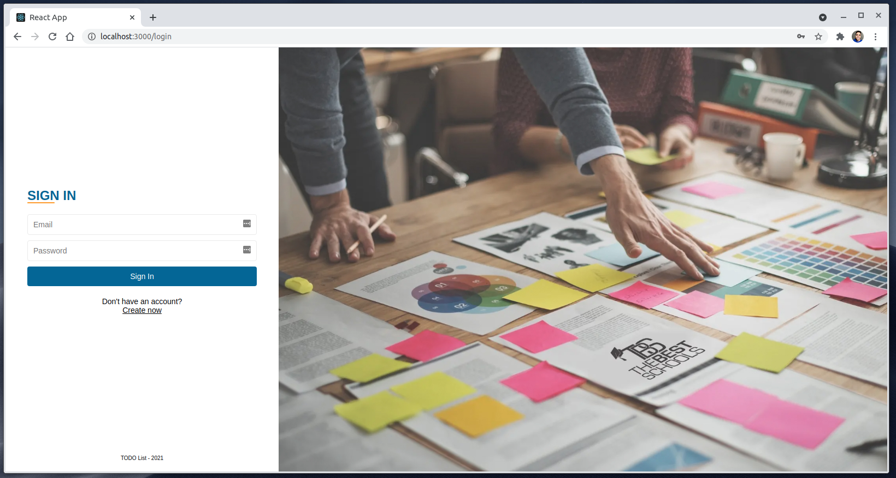
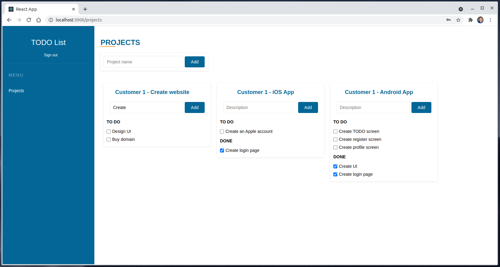

# TODO List - Frontend

## Description

This is a simple ToDo app made with React, Typescript, Styled-Components, Styled-System, Node.js, Nest and Jest


## Preview
<p align="center">
 
 
</p>

## Installation

```bash
$ npm install
```

## Running the app

```bash
# development
$ npm run start

```

## Test

```bash
# unit tests
$ npm run test
```
